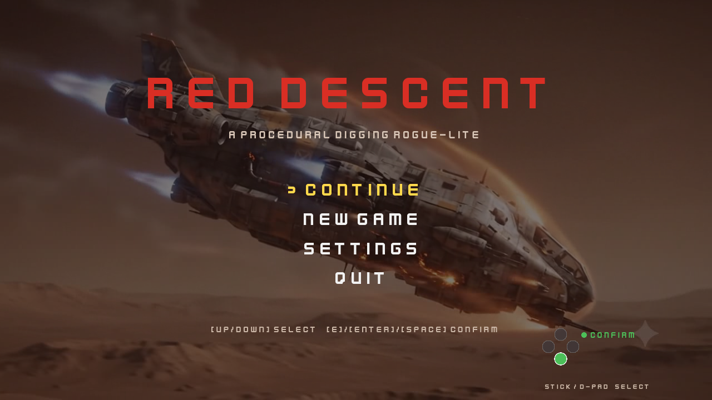
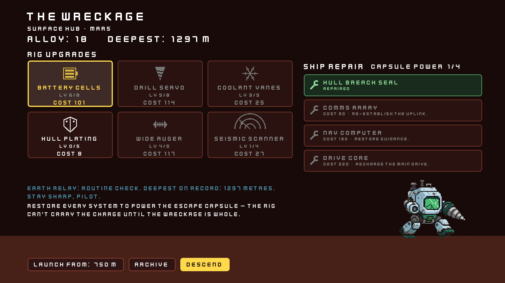
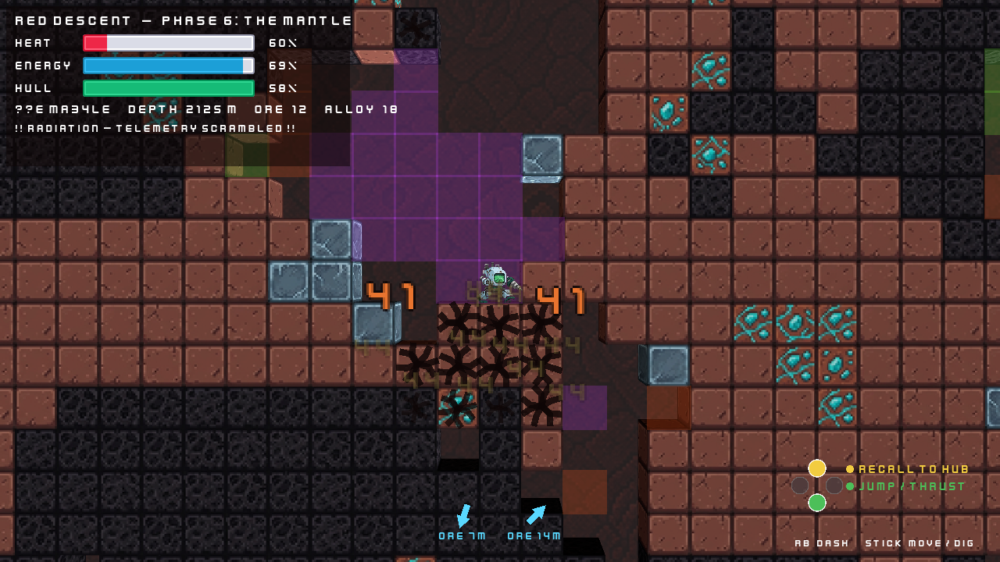

# Red Descent

A procedural rogue-lite digging game. A stranded zero-g asteroid miner crash-lands on Mars
and drills down through the planet's hostile crust in ill-suited vacuum gear — scavenging ore
to repair their ship, until what they uncover in the deep rewrites the whole reason they came.

Dig, balance your meters, cash out before something kills you, spend the haul on a better rig,
and dive deeper. Built in **Godot 4.5**.

## Screenshots

|  |  |
|---|---|
|  |  |
| **Main menu** | **The Wreckage** — your surface hub |

*A dive in progress — the crust is rendered as real 3D cubes (2.5D) lit by the rig's headlamp,
with ore veins glinting cyan and the Heat / Energy / Hull meters up top.*

## The loop

1. **The Wreckage (hub).** Spend banked **Alloy** on permanent **rig upgrades** and on
   **repairing your crashed ship**, pick how deep to launch, then descend.
2. **Dig.** Drill in any direction while juggling three meters — **Heat** (drilling, hotter
   the deeper you go), **Energy** (every action costs), and **Hull** (overheating, falling
   debris, and hazards chew through it).
3. **Find ore.** A cyan compass points to the nearest vein; ore gets richer the deeper you go.
4. **Cash out.** Hit **Recall** any time and the rig rockets to the surface, smelting your ore
   into Alloy. Push your luck and **die** — Energy 0 or Hull crushed — and you lose the haul.
5. **Upgrade, dive deeper, reach the Ruins, and escape.**

## Where you're digging

| Biome | Depth | What it's like |
|---|---|---|
| **The Crust** | 0–500 m | Dirt and rock, scattered ore, the occasional cave-in. The easy dig. |
| **The Mantle** | 500–1000 m | Dense basalt and permafrost, lava-tube caverns, and **hazard pockets** — toxic gas corrodes your hull, lava spikes your heat, radiation scrambles the HUD. Pressure rises the deeper you go. |
| **The Ruins** | 1000 m+ | Indestructible bulkhead architecture and rusted vault doors. A grand shaft drops to whatever's waiting at the bottom. |

## Your rig

Banked Alloy buys permanent upgrades — bigger batteries for longer dives, a stronger drill,
better cooling, tougher plating, a wider dig swath, and extra ore-compass pings. Separately,
you pour Alloy into **repairing the crashed ship** on the surface, which visibly reassembles
across runs. Every milestone of depth you reach unlocks a deeper **launch checkpoint**, so you
don't re-dig from the top every time. All of it persists between runs.

## Story

The descent is narrated as you go. Pilot logs crackle in as you cross depths and stumble into
hazards, buried **data logs** can be dug up out of the strata, and **Earth** hails you back at
the hub — drifting from routine reassurance into confusion at what you keep finding down there.
Review everything you've recovered in the hub **Archive**. The full arc runs from the crash all
the way to docking an ancient capsule, sacrificing your rig to power it, and launching for home.

## Controls

Keyboard and gamepad are always both active.

**Keyboard**

| Action | Keys |
|---|---|
| Move / dig sideways | `A` `D` / `←` `→` (hold into terrain) |
| Dig down / up | `S` / `↓` · hold `W` / `↑` into a block overhead |
| Jump / Thrust | `Space` (tap to jump; hold in air for the booster) |
| Dash | `Shift` |
| Recall · Buy / Repair (hub) | `E` / `Enter` |
| Launch descent (hub) | `Space` |

**Gamepad** — face buttons are placed by *position*, not letter (lettering differs across pads):
left stick / D-pad to move and dig, **A** (bottom) to jump/thrust, **RB** to dash, **Y** (top)
to recall or descend.

## Play it

Grab the latest build from the [**Releases page**](https://github.com/tjeffree/Red-Descent/releases),
unzip, and run — no engine required.

### Running from source

If you'd rather build it yourself:

1. Open Godot 4.5, choose **Import**, and select `project.godot` in this folder.
2. Let Godot import the assets on first open.
3. Press **F5** to play.

## Credits

Some of the art is my own; the rest, along with the audio, is CC0 (mostly
[Kenney](https://kenney.nl)) and OpenGameArt — see `CREDITS.txt` for full provenance and
licensing. Design notes live in `docs/`.
